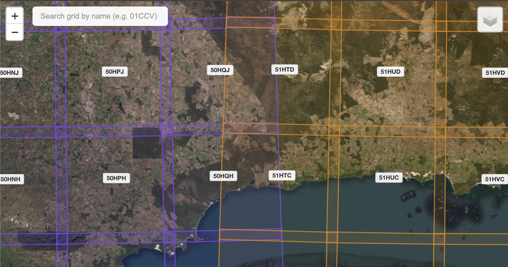

# Sentinel-2 Grid Explorer

Interactive web map for exploring Sentinel-2 satellite tile grids worldwide.

🌐 **[<ins>Check it out here!</ins>](https://dpird-dma.github.io/Sentinel-2-grid-explorer/)**

## Features

- Interactive map of Sentinel-2 grid tiles
- Search grids by name
- Colour-coded UTM columns
- Coverage area display
- Satellite and OpenStreetMap base layers

## Usage

Search for grid names (e.g., "01CCV") or explore the map to view Sentinel-2 tile boundaries and coverage areas.

## License

MIT License